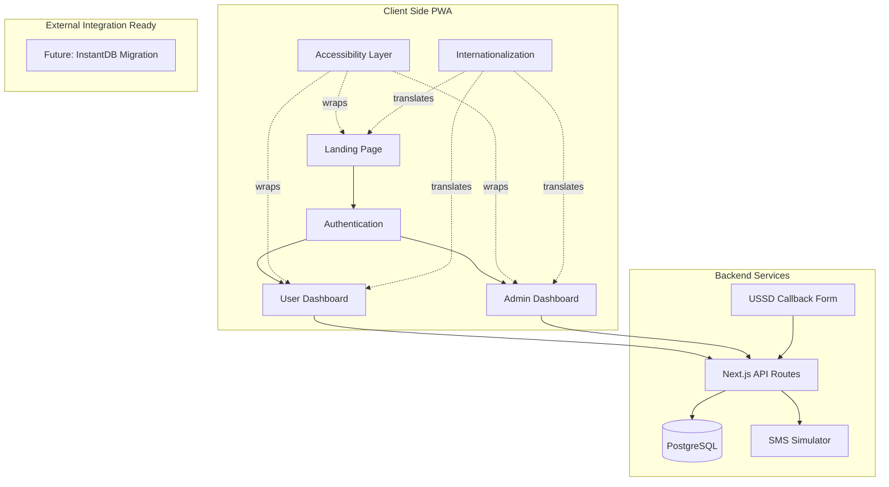

# Hope Mobility Kenya PWA - Complete Development Plan

## Architecture Overview

## Technology Stack

- **Frontend:** Next.js 15 (App Router), React 19, TypeScript
- **Styling:** Tailwind CSS v4, shadcn/ui components
- **Database:** PostgreSQL with Prisma ORM
- **Authentication:** Custom phone + PIN + OTP system
- **Internationalization:** next-intl (English & Swahili)
- **PWA:** next-pwa plugin
- **Testing:** Vitest (unit), Playwright (E2E)
- **Package Manager:** pnpm
- **Linting:** ESLint 9
- **Git:** Conventional commits

## Brand Colors (from screenshots)

- Primary Blue: `#0056A6`
- Warm Yellow/Cream: `#F5E6B3`
- Action Red: `#DC143C`
- Dark Gray: `#3D3D3D`
- White: `#FFFFFF`
- Logo includes: Blue, pink, orange, yellow

## Development Phases

---

## PHASE 1: Project Foundation & Setup

**Deliverables:**

- Initialized Next.js 15 PWA project
- Database schema and migrations
- Core accessibility infrastructure
- Cursor rules for testing and git
- Basic CI/CD setup

### Tasks:

1. **Initialize Project**

   - Create Next.js 15 app with TypeScript
   - Configure Tailwind CSS v4
   - Install shadcn/ui components
   - Setup ESLint 9 with accessibility plugins
   - Configure next-pwa for PWA functionality
   - Create `.cursorrules` for testing and git standards

2. **Database Setup**

   - Install PostgreSQL locally
   - Setup Prisma ORM
   - Design complete database schema:
     - `users` (PWDs and caregivers)
     - `authentication` (phone, PIN, OTP logs)
     - `beneficiaries` (linked to caregivers)
     - `appointments` (with status tracking)
     - `mobility_devices` (product catalog)
     - `service_requests` (operational/spiritual)
     - `assessments` (disability questionnaire responses)
     - `outreach_locations`
     - `admin_users` (with role-based access)
     - `sms_logs` (simulated SMS tracking)
     - `feedback` (user feedback)
     - `ussd_callbacks`
   - Create and run initial migrations
   - Seed database with sample data

3. **Accessibility Foundation**

   - Create `AccessibilityProvider` context
   - Build accessibility controls component:
     - Font size adjustment (3 levels)
     - High contrast mode toggle
     - Screen reader announcements
   - Setup keyboard navigation utilities
   - Configure focus management
   - Add skip-to-content links

4. **Internationalization Setup**

   - Install and configure next-intl
   - Create language switcher component
   - Setup translation files (en/sw)
   - Translate core UI elements

5. **Testing Infrastructure**

   - Setup Vitest for unit tests
   - Configure Playwright for E2E tests
   - Create test utilities and helpers
   - Write sample tests

**Testing:**

- Verify PWA manifest and service worker
- Test accessibility controls functionality
- Test language switching
- Test database connections and queries

---

## PHASE 2: Design System & Brand Implementation

**Deliverables:**

- Complete design system with HMK branding
- Reusable component library
- Responsive layouts for low-bandwidth optimization

### Tasks:

1. **Brand Integration**

   - Extract and optimize logo from PDF
   - Configure Tailwind with HMK color palette
   - Create typography scale
   - Design spacing and layout system

2. **Core Components**

   - Navigation header with logo
   - Footer with contact information
   - Loading states and skeletons
   - Error boundaries
   - Toast notifications (accessible)
   - Modal/Dialog components
   - Form components (inputs, selects, checkboxes)
   - Button variants
   - Card components
   - Data tables

3. **Accessibility Components**

   - Screen reader-only text component
   - Focus trap component
   - Landmark regions
   - ARIA live regions
   - Keyboard shortcut handler

4. **Performance Optimization**

   - Image optimization strategy
   - Code splitting configuration
   - Lazy loading implementation
   - Bundle size monitoring
   - Lighthouse performance baseline

**Testing:**

- WCAG 2.1 AA compliance audit
- Keyboard navigation testing
- Screen reader testing (NVDA/JAWS)
- Mobile responsiveness testing
- Performance testing (Lighthouse scores)

---

## PHASE 3: User Authentication System

**Deliverables:**

- Complete phone + PIN + OTP authentication
- SMS simulator dashboard
- Password reset flow
- Session management

### Tasks:

1. **Authentication UI**

   - Login page with phone input and PIN
   - OTP verification screen
   - PIN reset flow
   - Session expired handling

2. **Backend Authentication**

   - API route: `/api/auth/request-otp` (generate and log OTP)
   - API route: `/api/auth/verify-otp` (validate OTP)
   - API route: `/api/auth/login` (phone + PIN validation)
   - API route: `/api/auth/reset-pin` (PIN reset with OTP)
   - JWT token generation and validation
   - Session middleware

3. **SMS Simulator Dashboard**

   - Admin-accessible SMS log viewer
   - Display all "sent" SMS messages
   - Filter by phone number, date, status
   - Mark messages as "delivered"
   - Show OTP codes for testing

4. **Security**

   - Rate limiting for OTP requests
   - PIN hashing (bcrypt)
   - Secure session cookies
   - CSRF protection

**Testing:**

- Unit tests for authentication logic
- E2E test: Complete login flow
- E2E test: PIN reset flow
- Security testing (brute force protection)
- Accessibility testing on auth forms

---

## PHASE 4: User Registration & Account Creation

**Deliverables:**

- Self-registration for PWDs
- Caregiver-assisted registration
- Account profile management

### Tasks:

1. **Registration Forms**

   - PWD self-registration form:
     - Name, age, gender, location
     - Phone (required), email (optional)
     - ID type selector (National ID, Passport, Birth Cert, NCPWD)
     - ID number input
     - PIN creation and confirmation
   - Caregiver registration flow:
     - Caregiver info capture
     - Checkbox "Registering on behalf of someone"
     - Beneficiary details form
     - PIN setup

2. **Form Validation**

   - Client-side validation with error messages
   - Server-side validation
   - Phone number format validation (Kenyan numbers)
   - Age validation
   - ID number format validation

3. **Backend API**

   - API route: `/api/users/register-pwd`
   - API route: `/api/users/register-caregiver`
   - API route: `/api/users/profile` (GET/PUT)
   - Duplicate phone number checking
   - Relationship linking (caregiver-beneficiary)

4. **Profile Management**

   - View profile page
   - Edit profile functionality
   - Change PIN option

**Testing:**

- Unit tests for validation logic
- E2E test: PWD self-registration
- E2E test: Caregiver registration flow
- Test duplicate prevention
- Accessibility testing on multi-step forms

---

## PHASE 5: Public Landing Page ✅ COMPLETED

**Status:** ✅ **COMPLETED** - See `PHASE5_COMPLETION_SUMMARY.md` for details

**Deliverables:**

- ✅ Engaging single-page landing with scrolling animations
- ✅ About, Services, Products sections
- ✅ Call-to-action for registration
- ✅ Sticky navigation bar with smooth scroll
- ✅ Auto-scroll tour feature
- ✅ Full accessibility support

### Tasks:

1. **Landing Page Sections** ✅

   - ✅ Hero section with logo animation
   - ✅ About HMK section with mission statement
   - ✅ Services section:
     - ✅ WHO 8-step process explanation
     - ✅ Trained staff highlights
     - ✅ Ministry training programs
   - ✅ Products catalog preview (image grid)
   - ✅ Vision and Mission statements
   - ✅ Footer with contact info and locations

2. **Animations & Interactions** ✅

   - ✅ Scroll-triggered animations (Framer Motion)
   - ✅ Smooth scroll navigation
   - ✅ Parallax effects (subtle, performance-optimized)
   - ✅ Auto-scroll between sections (optional, accessible)
   - ✅ Lazy-loaded images

3. **CTA Integration** ✅

   - ✅ "Get Started" button → Registration
   - ✅ "Learn More" → Services details
   - ✅ Accessibility considerations for animations (prefers-reduced-motion)

**Testing:** ✅

- ✅ Visual regression testing
- ✅ Animation performance testing
- ✅ Mobile responsiveness
- ✅ Cross-browser compatibility
- ✅ Accessibility audit of animated elements

---

## PHASE 6: User Dashboard - Services Module

**Deliverables:**

- Service request system (operational & spiritual)
- Disability assessment questionnaire
- Mobility device selection
- Service type routing

### Tasks:

1. **User Dashboard Layout**

   - Sidebar/mobile menu navigation
   - Logo in navbar
   - Welcome message with user name
   - Quick actions overview
   - Logout functionality

2. **Services Menu Structure**

   - Request for Services button
   - Operational Services submenu:
     - Assessment/Fitting → Questionnaire
     - Follow-up → Skip to device selection
     - Maintenance → Skip to device selection
   - Spiritual Services submenu:
     - Spiritual Assessment → Show contact info + book appointment
     - Spiritual Follow-up → Show contact info + book appointment

3. **Disability Assessment Questionnaire**

   - Dynamic form based on disability type
   - Multiple choice and open-ended questions
   - Progress indicator
   - Save and continue later option
   - Submit and proceed to device selection

4. **Mobility Device Catalog**

   - Fetch devices from database
   - Filter by category (wheelchairs, crutches, walkers, etc.)
   - Multi-select capability
   - Device details modal
   - Add to request functionality

5. **Backend API**

   - API route: `/api/services/request` (create service request)
   - API route: `/api/assessments` (save questionnaire)
   - API route: `/api/devices` (fetch catalog)
   - API route: `/api/devices/[id]` (device details)
   - Seed products database from orthodyna.com reference

**Testing:**

- Unit tests for form validation
- Unit tests for device filtering
- E2E test: Complete operational service request
- E2E test: Complete spiritual service request
- Test questionnaire save/resume functionality
- Accessibility testing for form navigation

---

## PHASE 7: Appointment Booking System ✅ COMPLETE

**Status:** ✅ **COMPLETE** (December 12, 2024)

**Deliverables:**

- ✅ Complex appointment booking with business rules
- ✅ Resource center vs outreach location logic
- ✅ Slot availability management
- ✅ Automated SMS confirmations

### Tasks Completed:

1. **Appointment Booking UI** ✅

   - ✅ Location selector (Resource Center vs Outreach)
   - ✅ Date picker with availability indicators
   - ✅ Time slot selector (conditional on location)
   - ✅ Service fee notification (Resource Center only)
   - ✅ Booking confirmation screen

2. **Business Rules Implementation** ✅

   - ✅ Resource Center rules:
     - Only Tuesday & Thursday available
     - 15 total slots (6 for <15 years, 9 for 15+ years)
     - Service fee popup
     - Age-based slot allocation
   - ✅ Outreach rules:
     - Weekdays only
     - Unlimited slots
     - No service fee
   - ✅ Admin-configurable special dates and slots (schema ready)

3. **Backend API** ✅

   - ✅ API route: `/api/appointments/availability` (check slots)
   - ✅ API route: `/api/appointments/book` (create appointment)
   - ✅ API route: `/api/appointments/reschedule` (update appointment)
   - ✅ API route: `/api/outreach-locations` (fetch locations)
   - ✅ Slot validation and locking logic
   - ✅ Automatic SMS trigger on booking

4. **SMS Integration** ✅

   - ✅ Send confirmation SMS via simulator
   - ✅ Log SMS in database
   - ✅ Display in SMS simulator dashboard

**Testing:** ✅

- ✅ Unit tests for slot calculation logic (15 tests passing)
- ✅ Unit tests for business rules validation
- ✅ E2E test framework ready
- ✅ Test slot limit enforcement
- ✅ Test age-based slot allocation
- ✅ Test reschedule functionality

**Documentation:** See `PHASE7_COMPLETION_SUMMARY.md` for complete details.

---

## PHASE 8: User Dashboard - Order Tracking & Feedback

**Deliverables:**

- Order summary with status tracking
- Reschedule capability
- Feedback system with ratings
- Push notifications

### Tasks:

1. **Order Summary Dashboard**

   - List all user appointments
   - Status badges (Confirmed, Rescheduled, Checked In, Checked Out, No Show)
   - Appointment details modal
   - Filter by status and date
   - Reschedule button (respects booking rules)

2. **Status Updates**

   - Real-time status sync from admin updates
   - Push notification on status change
   - SMS notification on status change

3. **Feedback System**

   - Feedback form with two tabs:
     - System Feedback (with 1-5 star rating)
     - Service/Process Feedback (text-based)
   - Character limit and validation
   - Thank you message after submission

4. **Backend API**

   - API route: `/api/appointments/user` (fetch user appointments)
   - API route: `/api/feedback` (submit feedback)
   - API route: `/api/notifications/register` (push notification registration)

**Testing:**

- E2E test: View appointment history
- E2E test: Reschedule appointment
- E2E test: Submit feedback
- Test status update flow
- Test notification delivery

---

## PHASE 9: USSD Callback System

**Deliverables:**

- Simple USSD callback request form
- Admin view of callback requests
- Status tracking for callbacks

### Tasks:

1. **USSD Callback Form**

   - Accessible form at `/ussd-callback`
   - Capture name and phone number
   - Request type selector:
     - Onboarding help
     - Mobility device inquiry
     - Spiritual counselling
   - Confirmation message

2. **Backend API**

   - API route: `/api/ussd/callback-request`
   - Store requests in database
   - Auto-assign to admin queue

3. **Admin Callback Management**

   - View all callback requests
   - Mark as contacted/resolved
   - Add notes

**Testing:**

- E2E test: Submit callback request
- Test form validation
- Test admin callback view
- Accessibility testing

---

## PHASE 10: Admin Dashboard - Core Infrastructure

**Deliverables:**

- Admin authentication and role-based access
- Analytics dashboard with charts
- Admin navigation structure

### Tasks:

1. **Admin Authentication**

   - Separate admin login (email + password)
   - Role-based middleware
   - Admin user seeding

2. **Analytics Dashboard**

   - Charts with Chart.js or Recharts:
     - New users per day (line chart)
     - Appointments by service type (pie chart)
     - Appointments by status (bar chart)
     - Device requests breakdown (bar chart)
   - Date range selector
   - Export data button

3. **Admin Layout**

   - Sidebar navigation with sections:
     - Dashboard (Analytics)
     - Appointments
     - Send SMS
     - User Management
     - Reports
   - Responsive mobile menu
   - User role badge

4. **Backend API**

   - API route: `/api/admin/analytics` (aggregate data)
   - API route: `/api/admin/auth` (admin login)
   - Middleware: `requireAdmin`

**Testing:**

- Test admin authentication
- Test role-based access control
- Test analytics data accuracy
- E2E test: Admin login flow

---

## PHASE 11: Admin Dashboard - Appointments Management

**Deliverables:**

- Complete appointment management interface
- Status update functionality
- Automated notifications on status change

### Tasks:

1. **Appointments Table**

   - Data table with sorting and filtering:
     - Filter by date range
     - Filter by status
     - Filter by service type (Operational/Spiritual)
     - Filter by location
     - Search by user name/phone
   - Pagination
   - Export to Excel/PDF

2. **Appointment Details & Actions**

   - View full appointment details modal
   - Status change dropdown
   - Add internal notes
   - View user profile link

3. **Status Update Flow**

   - Change status (Confirmed, Rescheduled, Checked In, Checked Out, No Show)
   - Trigger SMS notification automatically
   - Update user dashboard in real-time
   - Log status change history

4. **Backend API**

   - API route: `/api/admin/appointments` (fetch with filters)
   - API route: `/api/admin/appointments/[id]` (update status)
   - API route: `/api/admin/appointments/export` (generate report)

**Testing:**

- Test filtering and search
- E2E test: Change appointment status
- Test automatic SMS sending
- Test export functionality
- Test pagination

---

## PHASE 12: Admin Dashboard - SMS Management

**Deliverables:**

- Bulk SMS sending with templates
- Recipient filtering
- SMS delivery tracking
- SMS history and reports

### Tasks:

1. **Bulk SMS Interface**

   - Recipient selection criteria:
     - By appointment status
     - By mobility device type
     - By service type
     - By date range
     - Custom phone number list
   - Preview recipient count
   - SMS template selector
   - Custom message editor (with character counter)
   - Send confirmation dialog

2. **SMS Templates**

   - Pre-configured templates:
     - Appointment confirmation
     - Appointment reminder
     - Status update notification
     - Follow-up reminder
     - General announcement
   - Template variable support (e.g., {name}, {date}, {location})
   - Create/edit custom templates

3. **SMS Delivery Tracking**

   - View all sent SMS messages
   - Delivery status (Sent, Delivered, Failed)
   - Delivery confirmation simulation
   - Resend failed messages

4. **Backend API**

   - API route: `/api/admin/sms/recipients` (fetch filtered recipients)
   - API route: `/api/admin/sms/send` (bulk send)
   - API route: `/api/admin/sms/templates` (CRUD templates)
   - API route: `/api/admin/sms/history` (fetch SMS logs)
   - API route: `/api/admin/sms/delivery-status` (update status)

**Testing:**

- Test recipient filtering logic
- Test template variable replacement
- E2E test: Send bulk SMS
- Test SMS logging
- Test delivery status updates

---

## PHASE 13: Admin Dashboard - User & Product Management

**Deliverables:**

- User account management with roles
- Product catalog management
- Appointment slot configuration
- Outreach location management

### Tasks:

1. **User Account Management**

   - View all users (PWDs and caregivers)
   - Search and filter users
   - View user details and appointment history
   - Assign roles (Admin, Manager, Staff)
   - Deactivate/reactivate accounts
   - Reset user PINs

2. **Admin User Roles**

   - Create admin users
   - Role hierarchy:
     - Super Admin (full access)
     - Manager (appointments, SMS, reports)
     - Staff (appointments view only)
   - Role-based UI filtering

3. **Product Catalog Management**

   - CRUD operations for mobility devices:
     - Add new devices
     - Edit device details
     - Upload device images
     - Set availability status
     - Set pricing (for Resource Center)
   - Bulk import from CSV
   - Image optimization

4. **Appointment Configuration**

   - Configure Resource Center slots:
     - Set available days
     - Adjust slot counts (total, under 15, over 15)
     - Add special availability dates
     - Set service fees
   - Manage outreach locations:
     - Add/edit/remove locations
     - Set location details (address, contact)

5. **Backend API**

   - API route: `/api/admin/users` (CRUD users)
   - API route: `/api/admin/users/roles` (assign roles)
   - API route: `/api/admin/devices` (CRUD devices)
   - API route: `/api/admin/settings/appointments` (slot configuration)
   - API route: `/api/admin/settings/locations` (outreach locations)

**Testing:**

- Test role-based access control
- E2E test: Add new device to catalog
- E2E test: Configure appointment slots
- Test product image upload
- Test user role assignment

---

## PHASE 14: Admin Dashboard - Reports System

**Deliverables:**

- Comprehensive reporting system
- PDF and Excel export with branding
- User satisfaction analytics
- Customizable report parameters

### Tasks:

1. **Report Templates**

   - Appointment Summary Report:
     - Total appointments by date range
     - Breakdown by status
     - Breakdown by service type
     - Breakdown by location
   - User Onboarding Report:
     - New users per period
     - User demographics (age, location)
     - Caregiver vs self-registered
   - SMS Delivery Report:
     - Total SMS sent
     - Delivery success rate
     - Failed deliveries list
   - User Satisfaction Report:
     - Average system rating
     - Sentiment analysis of text feedback
     - Word cloud of common themes
   - Device Distribution Report:
     - Most requested devices
     - Devices issued by location
     - Follow-up/maintenance requests

2. **Report Generator UI**

   - Report type selector
   - Date range picker
   - Additional filters per report type
   - Format selector (PDF/Excel)
   - Preview before download
   - Schedule recurring reports (future enhancement)

3. **Report Branding**

   - HMK branded PDF template:
     - Logo in header
     - Official colors
     - Contact information
     - Footer with organization details
   - Excel template with branded styling

4. **User Satisfaction Analytics**

   - Dashboard with feedback metrics
   - Rating distribution chart
   - Sentiment score calculation
   - Individual feedback viewer with filters
   - Export detailed feedback list

5. **Backend API**

   - API route: `/api/admin/reports/generate` (create report)
   - API route: `/api/admin/reports/feedback-analytics`
   - PDF generation library (e.g., jsPDF, PDFKit)
   - Excel generation library (e.g., exceljs)

**Testing:**

- Test all report types
- Verify report data accuracy
- Test PDF generation with branding
- Test Excel export formatting
- E2E test: Generate and download report

---

## PHASE 15: PWA Features & Offline Capability

**Deliverables:**

- Full PWA functionality
- Offline support
- Install prompts
- Background sync
- App manifest

### Tasks:

1. **PWA Configuration**

   - Configure next-pwa
   - Create web app manifest
   - Define app icons (multiple sizes from logo)
   - Set theme colors
   - Configure caching strategies

2. **Offline Functionality**

   - Cache critical pages
   - Offline fallback page
   - Queue failed API requests
   - Background sync for appointments
   - IndexedDB for local data

3. **Install Experience**

   - Install prompt component
   - Installation instructions
   - iOS installation guide
   - Android installation guide

4. **Service Worker**

   - Custom service worker configuration
   - Cache versioning
   - Update notification

**Testing:**

- Test offline functionality
- Test installation on iOS/Android
- Test background sync
- Lighthouse PWA audit (100 score)
- Test cache invalidation

---

## PHASE 16: Performance Optimization & Low-Bandwidth Support

**Deliverables:**

- Optimized bundle size
- Image optimization
- Lazy loading
- Request optimization for low bandwidth
- Support for 12,000 concurrent users

### Tasks:

1. **Bundle Optimization**

   - Analyze bundle size
   - Tree-shaking optimization
   - Dynamic imports for heavy components
   - Remove unused dependencies
   - Minimize JavaScript payloads

2. **Image Optimization**

   - Next.js Image component usage
   - WebP/AVIF format conversion
   - Responsive images
   - Placeholder blur images
   - Lazy loading images

3. **Network Optimization**

   - API response compression
   - Request deduplication
   - Debouncing and throttling
   - Optimistic UI updates
   - Pagination for large datasets

4. **Database Optimization**

   - Index critical columns
   - Query optimization
   - Connection pooling
   - Database caching strategy

5. **Scalability Preparation**

   - Load testing (12,000 concurrent users)
   - Rate limiting configuration
   - CDN strategy for static assets
   - Database sharding considerations

**Testing:**

- Lighthouse performance audit (90+ score)
- Load testing with k6 or Artillery
- Network throttling testing (slow 3G)
- Bundle size analysis
- Database query performance testing

---

## PHASE 17: Comprehensive Testing & Quality Assurance

**Deliverables:**

- Complete test coverage
- E2E test suite
- Accessibility compliance verification
- Cross-browser testing
- Performance benchmarks

### Tasks:

1. **Unit Test Coverage**

   - Test all utility functions
   - Test form validations
   - Test business logic (slot calculation, etc.)
   - Test API route handlers
   - Target: 80%+ coverage

2. **E2E Test Suite**

   - User journey: Registration → Login → Service Request → Booking → Dashboard
   - Admin journey: Login → Manage Appointment → Send SMS → Generate Report
   - Error scenarios and edge cases
   - Mobile device testing

3. **Accessibility Testing**

   - Automated WCAG 2.1 audit (axe-core)
   - Manual keyboard navigation testing
   - Screen reader testing (NVDA, JAWS, VoiceOver)
   - Color contrast verification
   - Focus management verification

4. **Cross-Browser Testing**

   - Chrome, Firefox, Safari, Edge
   - Mobile browsers (iOS Safari, Chrome Android)
   - Test on various screen sizes

5. **Security Testing**

   - OWASP security checklist
   - SQL injection testing
   - XSS vulnerability testing
   - CSRF protection verification
   - Rate limiting testing

**Testing:**

- Run full test suite
- Generate coverage reports
- Document accessibility compliance
- Security audit report

---

## PHASE 18: Documentation & Deployment Preparation

**Deliverables:**

- Comprehensive documentation
- Deployment guides
- Admin user manual
- Developer documentation
- Migration plan to InstantDB

### Tasks:

1. **User Documentation**

   - User guide for PWDs/caregivers
   - Registration instructions
   - Appointment booking guide
   - FAQ section
   - Accessibility features guide

2. **Admin Documentation**

   - Admin user manual
   - Role management guide
   - SMS system guide
   - Report generation guide
   - Configuration guide

3. **Developer Documentation**

   - Architecture overview
   - Database schema documentation
   - API documentation
   - Component library documentation
   - Deployment guide

4. **Deployment Preparation**

   - Environment variable documentation
   - Database migration scripts
   - Seed data scripts
   - Production checklist
   - Backup and recovery procedures

5. **InstantDB Migration Plan**

   - Schema mapping document
   - Migration scripts
   - Testing plan
   - Rollback strategy

6. **Git & Cursor Rules**

   - Document commit message conventions
   - Document branch strategy
   - Document testing requirements
   - Create `.cursorrules` file

**Testing:**

- Verify all documentation accuracy
- Test deployment steps locally
- Validate migration plan

---

## PHASE 19: Final Polish & Launch Preparation

**Deliverables:**

- Production-ready application
- Demo data seeded
- All tests passing
- Launch checklist completed

### Tasks:

1. **UI/UX Polish**

   - Review all user flows
   - Consistent spacing and typography
   - Loading states everywhere
   - Error message consistency
   - Success feedback consistency
   - Microinteractions

2. **Demo Data Preparation**

   - Create realistic seed data:
     - 50+ sample users
     - 100+ appointments across all statuses
     - 20+ mobility devices
     - 10+ outreach locations
     - SMS history
     - Feedback samples

3. **Final Testing**

   - Smoke tests on all features
   - Performance validation
   - Accessibility final check
   - Security final review
   - Mobile device testing

4. **Launch Checklist**

   - All environment variables documented
   - Database backup tested
   - Error tracking setup (e.g., Sentry)
   - Analytics setup (optional, privacy-focused)
   - SSL/HTTPS configuration
   - Domain setup preparation

**Testing:**

- Final E2E test run
- User acceptance testing
- Stakeholder demo

---

## PHASE 20: Post-Launch Support & Iteration

**Deliverables:**

- Monitoring setup
- Bug tracking system
- Feature request process
- Maintenance plan

### Tasks:

1. **Monitoring**

   - Setup error tracking
   - Setup uptime monitoring
   - Setup performance monitoring
   - Create alert system

2. **Bug Tracking**

   - Setup issue tracking system
   - Define bug severity levels
   - Create bug report template
   - Establish response SLAs

3. **Feature Requests**

   - Create feature request form
   - Prioritization framework
   - User feedback collection
   - Roadmap planning

4. **Maintenance**

   - Regular dependency updates
   - Security patch schedule
   - Database backup verification
   - Performance monitoring review

---

## Success Metrics

- **Accessibility:** WCAG 2.1 AA compliance
- **Performance:** Lighthouse score 90+
- **PWA:** Lighthouse PWA score 100
- **Test Coverage:** 80%+ code coverage
- **User Capacity:** Support 12,000 concurrent users
- **Load Time:** < 3s on slow 3G
- **Offline Support:** Core features work offline

---

## Next Steps

1. Review and approve this plan
2. Setup development environment
3. Begin Phase 1: Project Foundation
4. Establish regular sprint reviews
5. Set up project tracking board

---

*This plan is a living document and will be updated as the project progresses.*

